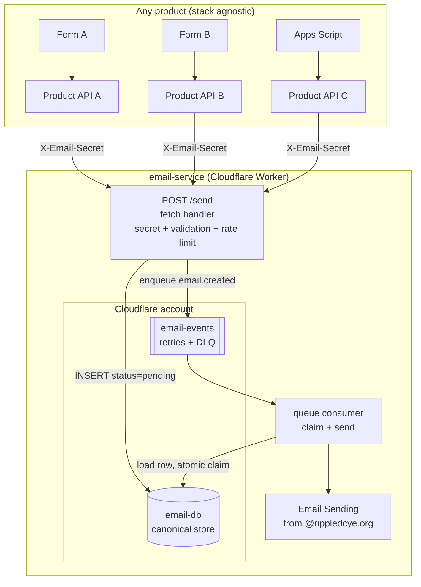
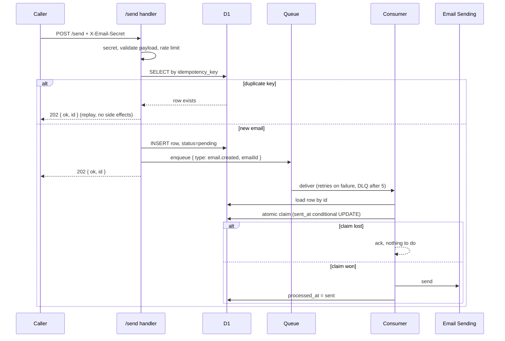

# Spec: Email Service (queue-based delivery API)

- Status: Draft for review
- Owner: stbensonimoh
- Repo: `rippledcyeorg/email-service`
- Date: 2026-08-20

The key words MUST, MUST NOT, SHOULD, SHOULD NOT, and MAY in this document are to be
interpreted as described in [RFC 2119](https://www.ietf.org/rfc/rfc2119.txt).

## 1. Objective

Every RipplED product sends email, but only the volunteer pipeline does today, and its
queue, D1, and Worker are coupled to volunteer data (queue messages reference
`volunteer-db` rows). This spec defines a standalone email service any product can call:
one secure endpoint, a durable queue, one consumer Worker, delivery from the already
onboarded `rippledcye.org` domain. It is stack agnostic by design: any form, API, script,
or Worker that can POST JSON with a secret header can send email.

The audience: RipplED engineers (the builders of the forms) and the founder (who approves
sender addresses and copy).

Success looks like: a caller POSTs once, gets an immediate 202, the email arrives from the
sender address that caller was granted, and duplicates are impossible.

## 2. Architecture Overview





Principles, carried over from the volunteer pipeline (proven in production 2026-08-20):

- D1 is the canonical store. The queue message carries the email id only, so a retried
  message can never re-send stale data.
- The send is claimed atomically with a conditional UPDATE before the email goes out, so
  simultaneous attempts and redeliveries send at most once.
- The service MUST NOT reach into caller databases. The full payload lives in its own D1
  row.

## 3. Components

### 3.1 HTTP API: `POST /send`

Served by the Worker's fetch handler (the service is a standalone Worker with a public
route, not a Pages Function).

- Auth: `X-Email-Secret` header, constant-time compare against the `EMAIL_SECRET` secret.
  Missing or incorrect secret MUST return 401. The secret is shared across RipplED
  products in v1; per-caller keys are out of scope.
- Payload (JSON):
  - `to`: required, `^[^\s@]+@[^\s@]+\.[^\s@]+$`, max 320 chars.
  - `from`: optional; defaults to `DEFAULT_FROM`. When present, MUST be exactly one of the
    `ALLOWED_SENDERS` config entries. Callers can only use sender addresses they were
    granted.
  - `subject`: required, 1..200 chars, no control characters (`[\x00-\x1F]`).
  - `text`: required, 1..100000 chars, no control characters.
  - `html`: optional, max 200000 chars.
  - `replyTo`: optional, single address, same pattern as `to`.
  - `idempotencyKey`: optional, 1..100 chars; defaults to a generated UUID. Callers SHOULD
    pass a stable key per business event so retries cannot double-send.
- Rate limit MUST be D1-backed: at most 10 requests per minute per IP and 200 requests per
  day per sender address. Over limit returns 429 with `Retry-After`.
- Duplicate handling: a payload whose `idempotency_key` already exists MUST return 202
  with the existing row id and MUST NOT enqueue. This makes caller retries harmless.
- On success: generate a UUID, insert with `status = 'pending'`, enqueue, respond 202
  `{ ok: true, id }`. If the enqueue fails after the insert, the request MUST still
  return 202; the row is canonical and the reconciliation job (3.4) recovers it.
- Logs MUST NOT contain the subject, bodies, or addresses. The email id only.

### 3.2 D1 database: `email-db`

```sql
CREATE TABLE IF NOT EXISTS emails (
  id               TEXT PRIMARY KEY,           -- uuid
  idempotency_key  TEXT NOT NULL UNIQUE,       -- dedupe gate
  to_address       TEXT NOT NULL,
  from_address     TEXT NOT NULL,
  reply_to         TEXT,
  subject          TEXT NOT NULL,
  text_body        TEXT NOT NULL,
  html_body        TEXT,
  status           TEXT NOT NULL DEFAULT 'pending',  -- pending | sent | failed
  sent_at          TEXT,                       -- atomic claim (conditional UPDATE)
  processed_at     TEXT,                       -- set by consumer after success
  created_at       TEXT NOT NULL,
  updated_at       TEXT NOT NULL
);

CREATE INDEX IF NOT EXISTS idx_emails_processed ON emails(processed_at);

CREATE TABLE IF NOT EXISTS rate_limits (
  ip         TEXT NOT NULL,
  sender     TEXT NOT NULL,
  created_at TEXT NOT NULL
);

CREATE INDEX IF NOT EXISTS idx_rate_limits_created ON rate_limits(created_at);
```

- `idempotency_key UNIQUE` is the dedupe gate; the application check (3.1) MUST be backed
  by the constraint.
- `sent_at` doubles as the send claim, the same pattern as `decision_email_at` in the
  volunteer pipeline.

### 3.3 Queue: `email-events` + `email-events-dlq`

- Message shape: `{ "type": "email.created", "emailId": "<uuid>", "occurredAt": "<ISO>" }`.
- Retry policy: 5 retries at a fixed 60-second delay, matching the volunteer queue.
- Exhausted messages MUST land in `email-events-dlq`; the consumer MUST mark the row
  `processed_at = 'failed'` and ack, never re-run the send.

### 3.4 Consumer (queue handler in the same Worker)

For each `email.created` message:

1. Load the row by id. Missing row: log and ack.
2. Claim the send: `UPDATE emails SET sent_at = ?, updated_at = ? WHERE id = ? AND
   sent_at IS NULL`. Zero changed rows means another attempt owns it: ack.
3. Send via the `EMAIL` binding. If `TEST_EMAIL` is set, redirect the recipient to it.
4. On send failure: release the claim (`SET sent_at = NULL WHERE id = ? AND sent_at = ?`,
   pinned to this attempt's timestamp), then throw so the queue retries.
5. On success: set `processed_at = 'sent'` and ack.

Reconciliation (scheduled handler, every 15 minutes): re-enqueue `email.created` for rows
older than 10 minutes with `processed_at IS NULL`, capped at 100 per run, and prune
`rate_limits` rows older than 24 hours.

### 3.5 Email Sending

- The `rippledcye.org` zone is already onboarded to Cloudflare Email Sending (SPF, DKIM,
  DMARC `p=reject` verified 2026-08-19). No new DNS work.
- The `send_email` binding MUST set `allowed_sender_addresses` to the `ALLOWED_SENDERS`
  list so the platform enforces the same allowlist the API checks.
- The founder creates the sender mailboxes. v1 senders are decided per product (see 6).

## 4. Configuration and secrets

All secrets live in Cloudflare Worker secrets; `.env.example` documents names only.

| Name | Kind | Purpose |
| --- | --- | --- |
| `DB` (D1 binding) | config | email-db |
| `QUEUE` (queue consumer + producer) | config | email-events |
| `EMAIL` (send_email binding) | config | Email Sending from rippledcye.org |
| `EMAIL_SECRET` | secret | shared secret for `X-Email-Secret` |
| `ALLOWED_SENDERS` | config | comma-separated sender addresses callers may use |
| `DEFAULT_FROM` | config | sender used when `from` is omitted |
| `TEST_EMAIL` | config | dev-only redirect for every recipient |

`keep_vars = true` MUST be set as a top-level key in wrangler.toml (before any `[[...]]`
tables) so dashboard-set vars survive deploys.

## 5. Testing strategy

- Unit tests (vitest): payload validation, secret auth, idempotent replay, rate limits,
  the claim/release cycle, DLQ marking, migration schema. The volunteer backend's
  `FakeD1` test helper pattern applies here unchanged.
- Integration: a scripted flow against `wrangler dev` with local D1, mirroring
  `backend/scripts/integration-flow.mjs` from call-for-volunteers:
  1. POST with valid payload and secret -> 202, row in D1.
  2. Same idempotency key again -> 202 with the same id, no second queue message.
  3. Missing or wrong secret -> 401.
  4. Bad payload (bad `to`, unknown `from`, control characters) -> 400 with field errors.
  5. 11th request in a minute -> 429.
  6. Send failure releases the claim so a retry re-sends.
- Live: one real email per sender, redirected to a test inbox via `TEST_EMAIL`, before the
  first product goes live.

## 6. Decisions

1. **Interface: HTTP + shared secret.** Stack agnostic by requirement; anything that can
   POST JSON works. A service binding MAY be added later for in-account Workers that want
   zero-auth calls, but it cannot be the only interface.
2. **Queue + D1 design copied from call-for-volunteers.** Same message shape (id only),
   same atomic claim, same DLQ and reconciliation. The patterns shipped and survived
   production the same week this spec was written.
3. **Per-form senders via an allowlist.** Callers pass `from`; the API and the send_email
   binding both enforce the allowlist, so one product cannot send as another.
4. **Idempotent replay returns the existing id** (202) instead of 409. Callers retrying
   after a network blip get the same answer and no duplicate email.
5. **Standalone repo and Worker.** No caller shares this repo's deploys, and this repo
   never imports caller code.

## 7. Out of scope for v1

- Per-caller API keys (one shared secret).
- Attachments, templates, unsubscribe handling.
- A delivery dashboard. DLQ rows surface as `status = 'failed'` in D1 and are queryable
  via the D1 console; a dashboard MAY come later if the founder needs one.
